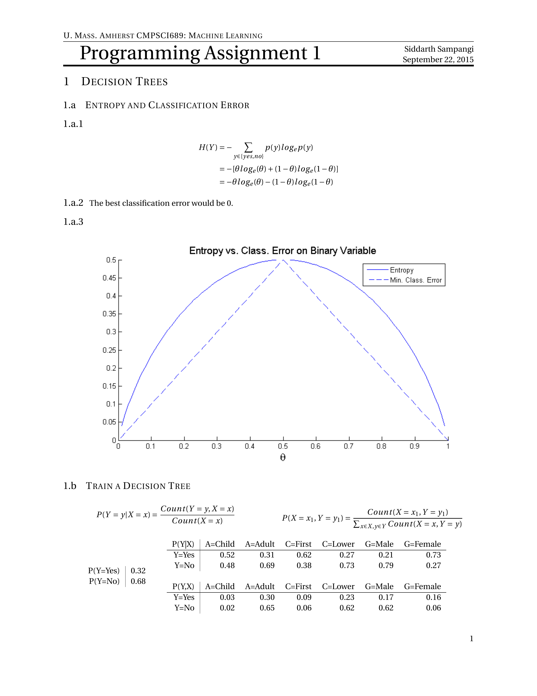
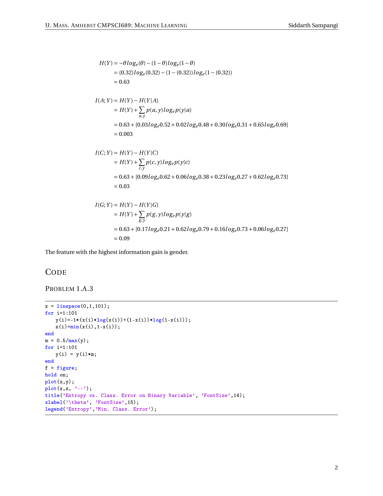

# Mini-LaTeX-Homework-Template
A minimalist LaTeX homework template that tries to keep extraneous details (title, name, school) out of the way of the content.

Features:
- Header has two fields for each corner. I use the left for school and class name, and the right for my name
- Numbered Pages
- Uses the fourier font package
- Title section condenses the title, name, and date into a single large line without compromising title size
- Includes the package/settings for referencing code files and images from the doc

Check out the example: 
